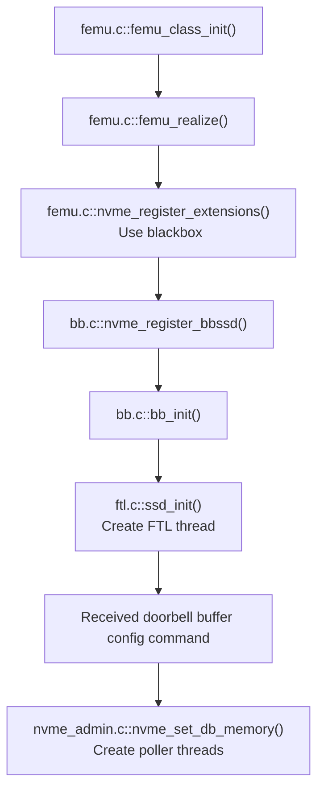
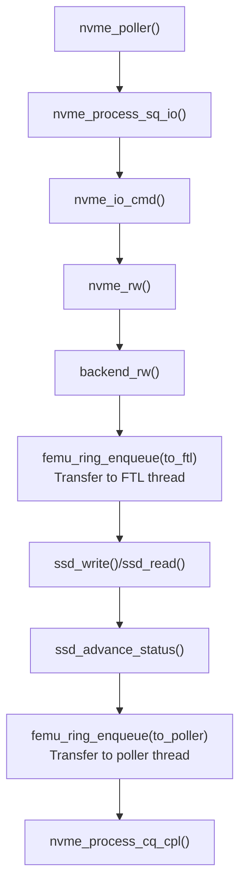

---
categories:
- SSD
- Simulator
date: 2023-07-02 19:36:00 +0800
last_modified_at: 2023-07-31 18:16:33 +0800
mermaid: true
tags:
- qemu
title: FEMU 代码分析
---

FEMU 是 FAST'18 上的一篇 SSD 模拟器论文（*The CASE of FEMU: Cheap, Accurate, Scalable and Extensible Flash Emulator*），在 QEMU 模拟器上实现。FEMU 使用内存模拟后端存储。时延的模拟是通过等待真实的时间流逝到期望的时延。FEMU 代码开源，源码仓库为：[GitHub - vtess/FEMU](https://github.com/vtess/FEMU)，位于 `hw/femu/` 目录下。本文对 FEMU 的代码进行分析学习。

## 编译和运行

在较新的 Linux 内核版本中 NVMe 初始化逻辑与之前不太相同，FEMU 无法正确完成初始化，会报以下错误。在最新的 FEMU 代码中已纠正，见 [Fix 5.19 Kernel NVMe CC issue by nicktehrany · Pull Request #96 · vtess/FEMU · GitHub](https://github.com/vtess/FEMU/pull/96)。

    nvme nvme0: Device not ready; aborting initialisation, CSTS=0x2

### QEMU 镜像

作者给出的 QEMU 镜像用户名和密码都是 femu。

可以使用 [DQIB](https://www.giovannimascellani.eu/dqib-debian-quick-image-baker.html) 作为 FEMU 的镜像，拥有最新的 Linux 版本，且不需要执行初始的镜像安装步骤。

```bash
#!/bin/bash
sudo ./x86_64-softmmu/qemu-system-x86_64 \
    -name "FEMU-BBSSD-DBIQ" \
    -cpu host \
    -m 4G \
    -smp 4 \
    -enable-kvm \
    -kernel ./dqib_amd64-pc/kernel \
    -initrd ./dqib_amd64-pc/initrd \
    -drive file=./dqib_amd64-pc/image.qcow2 \
    -device femu,devsz_mb=$((16*1024)),femu_mode=1 \
    -net user,hostfwd=tcp::2222-:22 \
    -net nic,model=virtio \
    -append "root=LABEL=rootfs console=ttyS0" \
    -nographic \
    -qmp unix:./qmp-sock,server,nowait 2>&1 | tee log
```

### 共享文件

QEMU 支持通过 virtio 的 9pfs 来在 host 与 guest 之间共享文件，详见 [Documentation/9psetup - QEMU](https://wiki.qemu.org/Documentation/9psetup)。

为了支持该功能需要在编译时指定 virtfs 选项：

```shell
sudo apt install libcap-ng-dev libattr-dev
../configure --enable-virtfs
```

在 qemu 启动命令中加入以下参数：

```bash
  -fsdev local,path=<folder-path>,security_model=mapped-xattr,id=fsdev-9p \
  -device virtio-9p-pci,fsdev=fsdev-9p,mount_tag=9pfs \
```

之后在 guest 内使用以下命令挂载：

```bash
mount -t 9p -o trans=virtio -oversion=9p2000.L [mount tag] [mount dir]
```

也可以在 guest 的 `/etc/fstab` 文件中加入对应的挂载项：

```bash
[mount tag] [mount dir] 9p trans=virtio,oversion=9p2000.L 0 0
```

### QEMU 终端

在启动 QEMU 后虽然直接进入了 guest 镜像但键盘输入仍被 QEMU 接管，可以通过 QEMU 的快捷键进入 QEMU 的管理终端，详见 [Keys in the character backend multiplexer — QEMU documentation](https://www.qemu.org/docs/master/system/mux-chardev.html)。

一些快捷键：

- Ctrl-a h：输出帮助信息
- Ctrl-a x：终止 QEMU
- Ctrl-a c：可以在 QEMU monitor 和 guest console 之间切换，在 monitor 中可以输入 QEMU 命令，比如 `info qtree` 可以列出当前使用的设备树及每个设备的详细信息。`info pci` 可以列出 PCI 设备信息

## 缩写

| 缩写    | 全称                       |
| ------- | -------------------------- |
| bb      | blackbox                   |
| db      | doorbell                   |
| lbaf    | lba format                 |
| cmb     | controller memory buffer   |
| ns      | namespace                  |
| ctrl    | control                    |
| sq(e)   | submission queue (element) |
| cq(e)   | completion queue (element) |
| nvme cc | nvme controller capability |
| ei      | eventidx                   |
| hva     | host virtual address       |

## 目录结构

目录 `backend/` 包含了用于保存模拟的 SSD 数据的内存后端代码，实现数据读写的功能模拟。

目录 `bb/` 包含了 blackbox SSD 对应的实现，blackbox 就是普通的黑盒 SSD，也就是 SSD 的管理是由内部的 FTL 进行的。该目录下主要包含的是 FTL 的实现。

`nand/` 文件夹下包含了一些 NAND 时延相关的代码，但只有 OCSSD 模式使用。

## 初始化

### QOM (QEMU Object Model)

FEMU 是 QEMU 的一个模块，QEMU 模块的编写遵循 QEMU 的对象模型（QOM），详见 [The QEMU Object Model (QOM) — QEMU documentation](https://www.qemu.org/docs/master/devel/qom.html)。FEMU 的初始化过程遵循 QOM 指定的初始化流程。

### 初始化流程

入口：`hw/femu/femu.c`。以 blackbox 模式为例：



首先是由 QEMU 触发的初始化，`femu_class_init()` 为入口，在该过程中会设置 PCIe 配置空间中的固定信息，注册 PCIe 的 BAR 以及 BAR MMIO 对应的函数（`nvme_mmio_ops` 中指定）。

主机与 FEMU 之间有三种地址空间：

1. **PCI 配置空间**。FEMU 没有指定 PCI 配置空间的读写函数，所以采用的是 QEMU 默认的 PCI 配置空间读写函数。可以通过在 `femu_class_init()` 函数中设置 `pc->config_write` 来拦截 PCI 配置空间的写入。
2. **PCI BAR MMIO 空间**。对于 PCI 设备来说，可以通过 BAR 暴露出额外的 MMIO 地址空间。NVMe 规定了用 BAR 空间来保存 CC (controller capability) 和 doorbell 寄存器等信息，也就是说 PCI 配置空间用于 PCI 协议，BAR 空间用于 NVMe 协议（支持 NVMe 的 PCI 设备）。在 FEMU 中，`nvme_mmio_ops` 结构中指定了对该 BAR 空间读写的操作函数：`nvme_mmio_read()` 和 `nvme_mmio_write()`。在 `nvme_mmio_write()` 中能够看到，FEMU 将 BAR 分为了三个部分：起始的区域（0~1000h）是 NVMe 协议规定的一些 capability 等结构，使用 `nvme_write_bar()` 处理；BAR 后面的则是 doorbell 寄存器数组，数组按照 SQ0, CQ0, SQ1, CQ1, SQ2, CQ2... 的方式组织。其中 SQ0/CQ0 队列对是用于 admin 命令的，FEMU 也将其进行了分开，分别用 `nvme_process_db_admin()` 和 `nvme_process_db_io()` 来处理。
3. **DMA 空间**。NVMe 的 SQ/CQ、数据传输以及下面提到的 shadow doorbell buffer 都是通过 DMA 进行的。上面的两种空间都是由设备也就是 FEMU 提供的，而 DMA 对应的地址空间则是由主机内存提供。上面的两种空间都是由 CPU 指定对应的总线地址来访问，而 DMA 则是由 CPU 将对应的内存区域注册为总线地址交给设备来访问。在 FEMU 中由于整个系统都是运行在 QEMU 模拟器进程中，使用的是同一块内存区域，所以 FEMU 可以直接对 DMA 区域进行 load/store 操作。FEMU 中以 `_hva` 为后缀的变量对应的内存就是 DMA 区域，可以直接进行读写来完成 DMA。

## NVMe Shadow Doorbell Buffer

该 NVMe 命令专为模拟的 NVMe 控制器设计的。在 NVMe Identify 命令中返回的 OACS (Optional Admin Command Support) 结构中说明了该控制器是否支持 doorbell buffer config 命令。

在正常情况下（不支持该命令的情况），主机必须要通过 MMIO 写 doorbell 寄存器对应的总线地址，因为主机使用的内存地址空间和 SSD 设备中 NVMe 控制器所在的总线地址空间不同。而在模拟的 NVMe 控制器情况下，主机和 NVMe 控制器都使用主机的内存地址空间，所以可以通过共享内存来修改 doorbell 寄存器。该命令就提供了两个数组：Shadow Doorbell Buffer 和 EventIdx。这两个数组的结构与普通的 doorbell 一样，由 SQ/CQ doorbell 交错组成。这两个寄存器的位置与 CQ/SQ 一样由主机在内存中分配并通过 doorbell buffer config 命令传递给 NVMe 控制器。Shadow doorbell buffer 数组由主机修改，EventIdx 数组由 NVMe 控制器修改。

在主机和 NVMe 控制器都使用该特性时，对 doorbell 的修改过程如下：主机将 SQE 写入到 SQ 中，并更新 shadow doorbell buffer 中对应的 SQ tail，之后主机判断还是否需要通过 MMIO 修改普通的 doorbell，判断条件是：如果新的 SQ tail 大于 eventidx 中对应的 SQ tail 且旧的 SQ tail (也就是 shadow doorbell buffer 修改之前的 SQ tail) 小于等于 eventidx 中的 SQ tail (`db_tail_old <= eventidx_tail < db_tail_new`)，那么就需要通过 MMIO 修改普通的 doorbell。EventIdx 是由 NVMe 控制器修改，保存的是 NVMe 控制器当前处理完的 SQE 对应的 SQ tail。如果主机在更新 SQ tail 之前 `eventidx_tail < db_tail_old`，那就代表 NVMe 控制器还没有赶上之前进度，还在忙碌，那么这种情况下就不需要显式地通过 MMIO 通知 NVMe 控制器 SQ tail 更新了，因为 NVMe 控制器还在处理，之后会主动读取 `db_tail`。而如果在更新之前 `eventidx_tail >= db_tail_old`，那就说明 NVMe 控制器已经赶上了之前的进度，NVMe 控制器目前处于空闲状态，这时就需要通过 MMIO 显式通知 NVMe 控制器使其忙碌起来。

在虚拟化场景下（比如每台虚拟机与模拟的 NVMe 控制器进行通信而不是直接与 SSD 进行通信），这样的好处是能够避免 MMIO 次数，从而提高性能。

> In an environment with several guest OSes on top of a VMM sharing a resource, communication between the guest OS and the real device is usually trapped by the VMM. As an MMIO is usually a syncronous acces to the device, it means that every MMIO access will cause a trap.
> .png){: .normal }
> The main idea here is to decrease the number of traps to the VMM by reducing the number of writtes to the doorbells.[^1]

FEMU 在该 NVMe 命令的处理函数中启动 poller 线程，该命令对 FEMU 很关键，是 FEMU 初始化必须调用的命令。

## 数据结构

`struct FemuCtrl` 代表了 FEMU 的 NVMe 类型，是顶层的数据结构，用于控制平面。

`FemuCtrl` 一些主要的成员：

```cpp
struct FemuCtrl {
    NVMeSQueue      **sq;        // IO send queue
    NVMeCQueue      **cq;        // IO completion queue
    NVMeSQueue      admin_sq;    // admin send queue
    NVMeCQueue      admin_cq;    // admin completion queue
    struct rte_ring **to_ftl;    // poller to FTL queue
    struct rte_ring **to_poller; // FTL to poller queue
    pqueue_t        **pq;        // priority queue, used to
                                 // sort request by finish time
}
```

`struct NvmeCmd` 代表了 SQE。

FEMU 不支持 SGL 类型的数据地址描述。

## 配置

在 `ftl.c:ssd_init_params()` 中指定了一些参数，如 page 大小、pages per block、channel 数等等。

## QEMU 线程

FEMU 引入了额外的线程来处理：FTL 线程和 NVMe poller 线程。其中 FTL 线程用于运行 FTL 并计算 NAND 访问时延；NVMe poller 线程用于从 SQ 中拉取命令进行处理并对 CQ 进行操作。两类线程都是运行 while 循环不断地从各自队列中取出数据并进行相应计算。FTL 线程和 NVMe poller 线程之间通过 `to_ftl` 和 `to_poller` 两个队列进行通信。FTL 线程只有 1 个，poller 线程可以有多个（每个 SQ/CQ 对应一个 poller ）。

Poller 线程会循环处理 SQE。首先 poller 会进行功能模拟，之后将该请求通过 `to_ftl` ring 传递给 FTL 线程，FTL 线程计算该请求的时延，之后通过 `to_poller` ring 传递给 poller 线程，poller 线程收到后会进行 CQ 的处理逻辑，在 `nvme_process_cq_cpl()` 中会进行时延的模拟。

## IO 处理流程



## FTL

FTL 线程只有一个，所以模拟请求的处理时不需要考虑数据结构的并发访问，简化了编程。FTL 只进行时延模拟，不进行功能模拟，具体读写数据的保存和拷贝是由 DRAM backend 模块支持的。

FEMU 的 FTL 只实现了地址映射和垃圾回收功能，没有考虑磨损均衡、缓存管理、坏块管理、ECC 等等。

FTL 主要的数据结构有：

1. Page 粒度映射表 `struct ssd.maptbl`。直接使用数组保存 LPN->PPN 的映射
2. 反向映射表 `struct ssd.rmap`。使用数组保存 PPN->LPN 的映射
3. 用于 FTL 的空闲 line 链表 `struct line_mgmt.free_line_list`
4. 用于 FTL 的全部包含有效数据的 line 链表 `struct line_mgmt.full_line_list`
5. 用于 FTL 的包含部分有效数据的 line 优先级队列 `struct line_mgmt.victim_line_pq`
6. 当前写位置指针 `struct write_pointer`，指向当前的 line 以及 line 内的具体位置

FEMU 将 NAND 按照 channel、LUN、blk、page 进行划分。目前只支持一个 plane。FTL 以 line 为单位进行管理（相当于 superblock），所有 LUN 的第 i 个 block 组成了第 i 个 line。在写入数据时，会在当前 line 内进行追加写入，写入顺序按照 channel、lun 的顺序。当该 line 写满之后会从 `free_line_list` 中选取一个空的 line 作为当前写入的 line。在写入页面时会更新 `maptbl` 和 `rmap`，如果该 LPN 之前写过数据会把之前写入的页标记为 invalid，并且将对应 blk 和 line 的 ipc (invalid page count) 加一，同时会改变该 line 在 `victim_line_pq` 优先级队列的顺序。在需要 GC 时，会从 `victim_line_pq` 中选取最前面也就是 ipc 最大的 line 进行垃圾回收。

主要函数是 `ssd_advance_write_pointer()`、`ftl_thread()` 和 `ssd_write()`。

{: width="400" }

### 时延模拟

时延的模拟是在 FTL 模块中进行的，主要的函数为 `ssd_advance_status()`。时延的模拟是通过计算每个 LUN 的下一个空闲时间 `struct nand_lun.next_lun_avail_time` 进行的。FEMU 只模拟了 NAND 的读、写、擦除时延，没有考虑传输时延、FTL 计算时延等。另外对 NAND 的操作只模拟了数据的操作，没有 FTL 元数据对应的 NAND 操作。FTL 线程计算好时延后会将请求入队 `to_poller`，poller 线程在 `nvme_process_cq_cpl()` 函数中从队列中取出计算好时延的请求，并插入到按照请求完成时间排序的优先级队列 `struct FemuCtrl.qp` 中。之后 `nvme_process_cq_cpl()` 会从该优先级队列中取出完成时间最早的请求，并比较当前的时间判断该请求是否完成，如果完成则调用 `nvme_post_cqe()` 将请求对应的 cqe 插入到 cq 中。

对于 ZNS 来说，SQE 处理完仍会入队 `to_ftl`，不过在处理 CQE 时也是从 `to_ftl` 中获取而不是从 `to_poller` 中获取，因为 ZNS 没有额外的 FTL 时延计算。

### 垃圾回收

FEMU 设计了两个垃圾回收阈值，在每个 IO 命令完成后会判断空闲 line 数是否小于 25%，如果是则会进行垃圾回收；在写 IO 开始时会判断空闲 line 是否小于 5%，如果是则会触发垃圾回收。

在垃圾回收时，会从 `victim_line_pq` 优先级队列中选取第一个也就是失效页面数最多的 line，并将该 line 中的有效的数据按照正常 IO 写的方式追加到当前的 `write_pointer` 指向的位置。由于 FTL 只进行时延模拟，所以并没有真实的数据拷贝，在 GC 过程中只是计算 `next_lun_avail_time`。

[^1]: [LN Koike: Increased performance of emulated NVMe devices](http://helenfornazier.blogspot.com/2016/08/increased-performance-of-emulated-nvme.html)